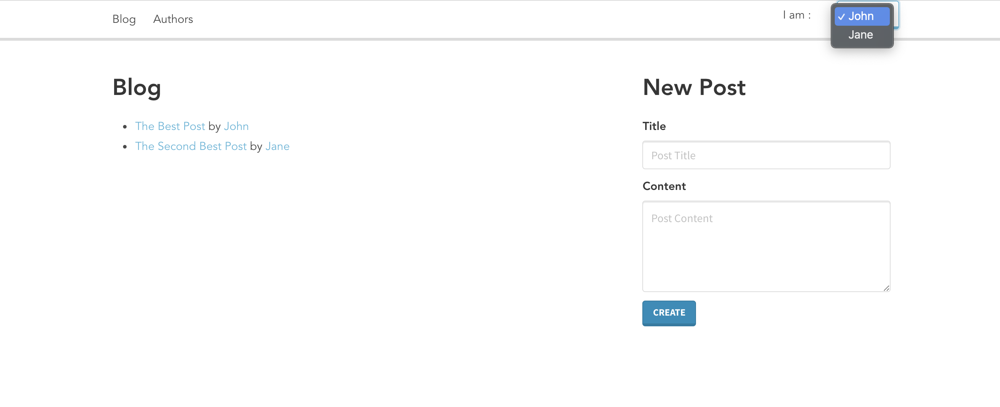

# Fullstack JS Training

A simple blog-like / forum project, inspired by the one for the [Rails tutorial](https://guides.rubyonrails.org/getting_started.html).
Its goal is to train/refamiliarize me with popular web development frameworks in node.js. Currently, it uses an express API and a Vue.js front-end. I plan to add more along the way, starting with a version of the client in React.



## Installation

This project uses :

- Node.js 16.4
- Sqlite 3

Packages must be installed for each subfolder, eg :

```
> cd api
> yarn
```

In order to be able to launch the API a `blog-dev.sqlite3` database must be created in the `api/` folder (as well as a `blog-test.sqlite3` for running tests).

## Usage

One API must be launched (currently on port 3000), then a client can be served and interacted with.

```
> cd api
> yarn start
// In another shell
> cd client-vue
> yarn serve
```

## Source code

The project is a very basic blogging/forum app. It has a list of users that can make posts. The main idea was to have a basic CRUD structure.

All projects use eslint for linting and prettier for code formatting.
I also decided to try out the [Conventional Commits](https://www.conventionalcommits.org/en/v1.0.0/) convention for this project.

### API

For the moment there is only one API, my main focus was to train with front-end frameworks so I'm not sure whether I'll make any alternative version.

It uses [Express](https://expressjs.com/) and [Sequelize](https://sequelize.org/) with [SQLite](https://www.sqlite.org/index.html). I chose Sequelize because it seems to be very popular and I hadn't ever tried it so far. Now that I have, I would probably choose another one if I had to make a project (I liked [Objection](https://vincit.github.io/objection.js/) and although I haven't tried it yet I've heard good things about [TypeORM](https://typeorm.io/#/)). SQLite3 was chosen for its ease of use, any SQL would have worked (since my main goal was to test Sequelize).

The next time I make a node API I might try a fully-fledged out framework instead, like [NestJS](https://nestjs.com/) or [AdonisJS](https://adonisjs.com/).

#### Architecture

I decided to switch from MVC to a module/component architecture similar to the one described in [this blog post](https://larswaechter.dev/blog/nodejs-rest-api-structure/). For the code, I was heavily inspired by [n9-node-micro](https://github.com/neo9/n9-node-micro) and [n9-micro-starter](https://github.com/neo9/n9-micro-starter).

I find that it makes more sense for the different files to be organized by concern rather than category in an API project. The model, controller, service and route files of a database table will be far more interconnected one with another than with those of external tables. Having an explicit mention of a file's type in its name (e.g. `users.controller.js`) also makes searching for them a lot easier.

This might cause a few issues with the sequelize-cli scaffolder since it seems to assume an MVC structure, but I think it's worth it.

#### Tests

Having already used [Mocha](https://mochajs.org/) + [Chai](https://www.chaijs.com/) and [AVA](https://github.com/avajs/ava) in the past I decided to try [Jest](https://jestjs.io/) this time around. I also use [factory-girl](https://github.com/simonexmachina/factory-girl) to avoid bloating end-to-end tests with database initialization or using redundant seeders which can make it hard to know exactly what is being tested.

### Front-End

#### Vue

The Vue client is made with [Vue 3](https://v3.vuejs.org/), [Vue Router](https://next.router.vuejs.org/) and [Vuex](https://next.vuex.vuejs.org/). It uses [Axios](https://axios-http.com/) to make requests to the API and [Bulma](https://bulma.io/) as a CSS framework (with a custom theme from [bulmaswatch](https://jenil.github.io/bulmaswatch/)).
